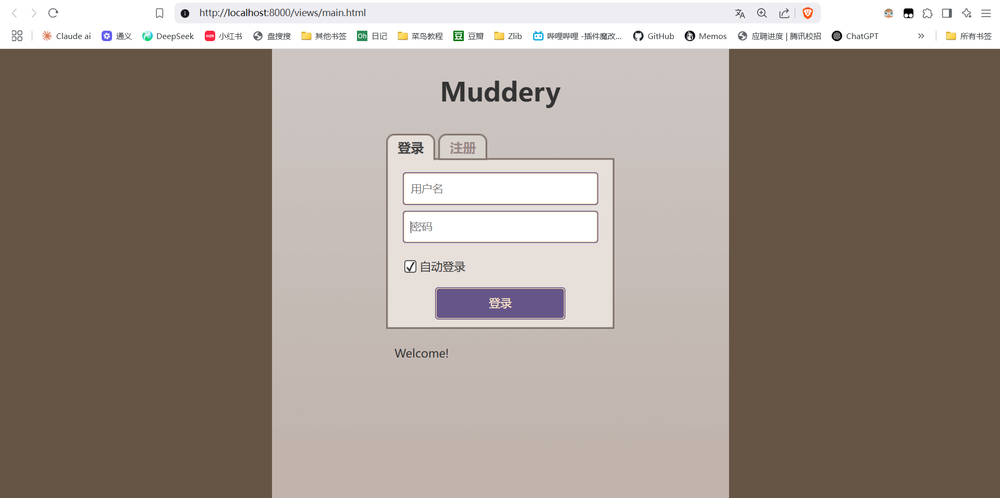
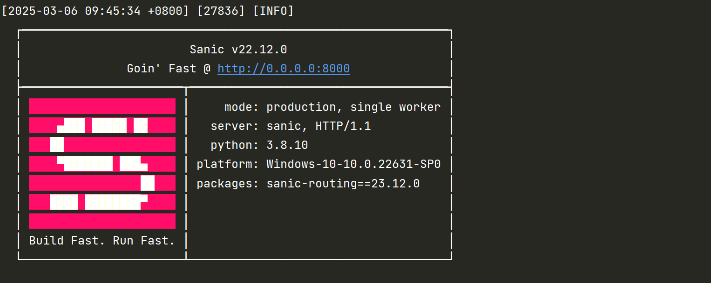
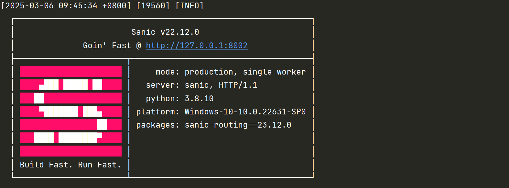

# Intro
Muddery is an online text game (like MUD) framework in Python. It is licensed under 3-clause BSD license.
Muddery 是一个用 Python 编写的在线文本游戏（类似 MUD）框架。它遵循 3 条款 BSD 许可证。

# 安装
1. Install Python3.7+ and GIT. Start a Console/Terminal.
1. `cd` to some place you want to do your development. 
1. `git clone https://github.com/muddery/muddery`
1. `python -m venv mudenv` #创建一个名为mudenv的虚拟环境
1. `source mudenv/bin/activate` (Linux, Mac) or `mudenv\Scripts\activate` (Windows)
1. `python.exe -m pip install --upgrade pip` #更新pip
1. `pip install -e .`#建议挂梯子执行。
1. `pip install -e muddery` #建议挂梯子执行。
1. `muddery init mygame` #创建一个名为mygame的游戏。执行以后，关闭终端。然后重新打开一个新的终端，再继续执行后续命令
1. `cd mygame` 
1. `muddery setup`
1. `muddery start`

# 开服
1. `cd mygame` 
1. `muddery start`

# 访问
Muddery should now be running and you can connect to it by pointing your web browser to http://localhost:8000.

# 关服
If you want to stop the server, you can use `muddery stop`.

# 运行示例

